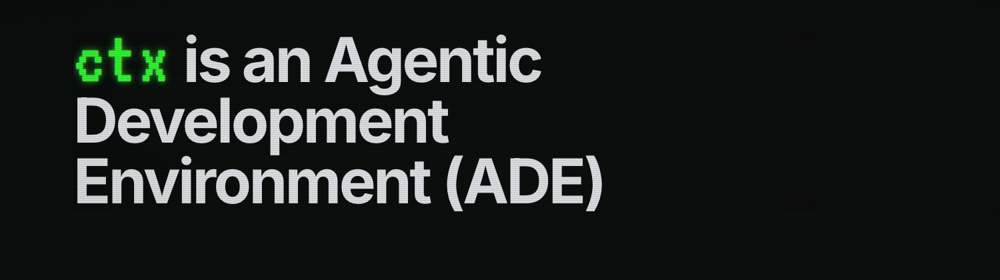
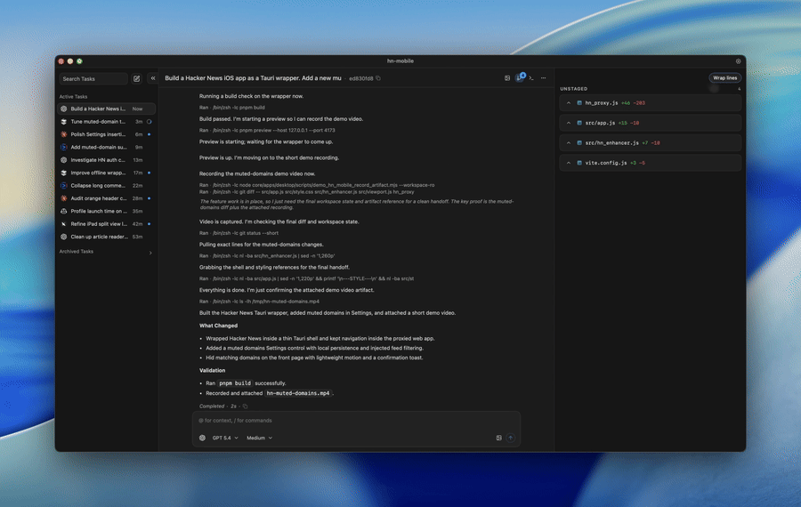

<p align="center">
  
</p>

**Any coding agent. Containerized workspaces. Unified transcripts and review.**

CTX is an open-source Agentic Development Environment (ADE) for teams using multiple coding agents. It gives engineers one interface for the real Claude Code, Codex, Cursor, and more. It gives security and platform teams one controlled runtime with containerized disk and network isolation, one review surface, and durable transcripts.

Use ctx on your own machine or against a remote devbox or VPS you control. For normal local workflows, you do not need a ctx account, and you can bring your own providers, models, and credentials.

<p align="center">
  
</p>

## Install

```bash
curl -fsSL https://ctx.rs/install | sh
```

- Website: https://ctx.rs
- Blog: https://ctx.rs/blog
- Install guide: https://ctx.rs/getting-started/install-and-launch/

## Source Status

This repository is the open-source ADE source tree for `ctxrs/ctx`. It is intentionally fresh-history and does not include private monorepo git history.

The ADE source is licensed under GPL-3.0-or-later. See [LICENSE.md](LICENSE.md).

Hosted and control-plane service code is not part of this ADE source tree. That boundary belongs in the separate control-plane project: https://github.com/ctxrs/control-plane.

## Build From Source

Public source builds are local developer builds. They do not require official release infrastructure, maintainer-only credentials, or managed cloud hosts.

Prerequisites:

- Rust stable
- Node.js 20+ with Corepack
- pnpm 9.15.1
- Platform desktop dependencies if building the Tauri app, including GTK/WebKitGTK on Linux

Install dependencies and build the Rust workspace:

```bash
git clone https://github.com/ctxrs/ctx.git
cd ctx
cd core
corepack enable
pnpm install --frozen-lockfile
cargo build --workspace
```

Run the daemon and web workbench locally in separate terminals:

```bash
cd core
cargo run -p ctx-http --bin ctx -- serve --bind 127.0.0.1:4399 --data-dir "${CTX_DATA_DIR:-$HOME/.ctx}"
```

```bash
cd core
pnpm -C apps/web dev
```

Launch the desktop app from source:

```bash
cd core
pnpm desktop:dev
```

Build the desktop app from source:

```bash
cd core
pnpm desktop:build
```

Official signed installers, updater feeds, release promotion, and production release automation are maintained by CTX maintainers outside this public source tree. Source builds should use local Tauri tooling and local runtime artifacts only.

Released binaries may include product telemetry for reliability and product analytics. Telemetry should be documented, user-controllable where applicable, and bounded so it does not collect source code, prompt contents, transcripts, tool output, secrets, local file paths, or local file contents.

## What ctx helps you do

- Use Claude Code, Codex, Cursor, and other coding agents in one interface
- Run agents in isolated containers with explicit disk and network controls
- Let agents work with bounded autonomy instead of constant approval prompts
- Keep tasks, sessions, diffs, transcripts, and artifacts in one review surface
- Run work locally or on remote machines you control
- Keep parallel tasks isolated in separate worktrees and land them cleanly with the agent merge queue

## Why standardize on the environment

- Engineers can use the agents they prefer without fragmenting the workflow
- Security and platform teams can rely on one runtime model and one set of safety controls
- Review, provenance, and task history stay in one place instead of being scattered across tools
- You can change harnesses and models over time without rebuilding team workflows around each one

## Get started

Use one small, low-risk task to validate the whole loop end to end: install, connect a provider, open a workspace, run a task, and review the diff before you finalize changes.

- [Install and launch](docs/getting-started/install-and-launch.mdx)
- [Connect a provider](docs/getting-started/connect-provider.mdx)
- [Add a workspace](docs/getting-started/add-workspace.mdx)
- [Run your first task](docs/getting-started/first-task.mdx)

## Learn more

- [Workbench tour](docs/workbench/tour.mdx)
- [Containerization](docs/containerization.mdx)
- [Agent Merge Queue Overview](docs/agent-merge-queue-overview.mdx)
- [What is a worktree?](docs/what-is-a-worktree.mdx)
- [ADE vs CLI](docs/ade-vs-cli.mdx)
- [ADE vs IDE](docs/ade-vs-ide.mdx)
