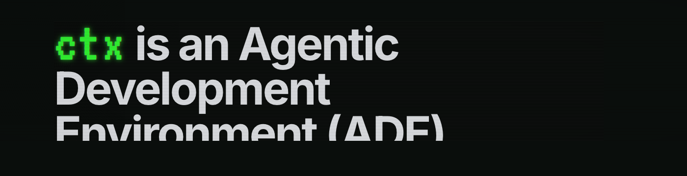

<p align="center">
  <picture>
    <source srcset="assets/readme/header.webp" type="image/webp" />
    
  </picture>
</p>

**Any coding agent. Sandboxed workspaces. Unified transcripts and review.**

ctx gives teams one interface for the real Claude Code, Codex, Cursor, and more. Run locally or on a devbox or VPS you control. For normal local workflows, you do not need a ctx account. Bring your own providers, models, and credentials.

[](https://ctx.rs/videos/ctx-homepage-demo.mp4)

## Install

```bash
curl -fsSL https://ctx.rs/install | sh
```

- Website: https://ctx.rs
- Blog: https://ctx.rs/blog
- Install guide: https://ctx.rs/getting-started/install-and-launch/

## What ctx helps you do

- Use multiple coding agents in one interface
- Run agents in isolated workspaces with explicit disk and network controls
- Keep tasks, sessions, diffs, transcripts, and artifacts in one review surface
- Work locally or on remote machines you control
- Keep parallel work isolated in separate worktrees and land changes cleanly

## Why standardize on the environment

ctx lets engineers keep the agents they prefer without fragmenting the workflow. It gives platform and security teams one runtime model, one review surface, and durable provenance instead of scattered transcripts, diffs, and tool state across separate products.

## Quick start

1. Install ctx.
2. Open the app and connect a provider.
3. Add a workspace.
4. Run one small task.
5. Review the diff before you finalize changes.

## Good first tasks

- Fix one obvious bug in a narrow area
- Update one label or validation message
- Make one small UI, docs, or config change

## Learn more

- Install and launch: https://ctx.rs/getting-started/install-and-launch/
- Connect a provider: https://ctx.rs/getting-started/connect-provider/
- Add a workspace: https://ctx.rs/getting-started/add-workspace/
- Run your first task: https://ctx.rs/getting-started/first-task/
- Workbench tour: https://ctx.rs/workbench/tour/
- What is a worktree?: https://ctx.rs/what-is-a-worktree/
- Agent Merge Queue: https://ctx.rs/agent-merge-queue-overview/

## Feedback

Use this repository for bugs, feature requests, and product feedback about ctx.
