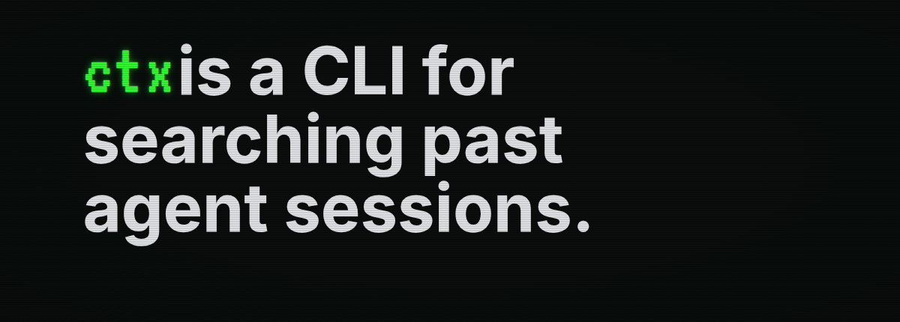

ctx is an open-source CLI for fast local search across your past coding agent
sessions.

Coding agents usually start from zero. They can inspect the current repo, but
they often cannot recover the discussions, decisions, failed attempts,
commands, and test results from earlier work.

Those sessions are full of useful context:

- decisions, constraints, intent, and rejected approaches from you
- bug investigations, refactors, file paths, commands, patches, and notes from previous agents

ctx indexes those logs into SQLite on your machine, then gives current and
future agents a CLI for finding the prior discussion, command, or failed
attempt before they repeat it.

## Install

```bash
curl -fsSL https://ctx.rs/install | sh
```

Installs ctx and indexes discovered local agent history.

Build from this checkout:

```bash
cargo build -p ctx
cargo install --path crates/ctx-cli
```

## How it works

Your past agent sessions are stored in local provider history files. ctx
discovers supported sources, imports the real persisted records, and stores
normalized session and event data in a local SQLite database optimized for
retrieval.

ctx is written in Rust and stores a local SQLite index, so searches are fast,
scriptable, and do not require a background service.

```bash
# Index all of your existing local agent sessions
ctx setup

# Your agent can search prior work with normal language
ctx search "failed migration"

# Results include matching sessions, snippets, and ctx IDs
# evt_01h...  ses_01h...  codex  "migration expected the old cursor name" ...

# Print the matching part of the old transcript
ctx show event <ctx-event-id> --window 3

# Or print a compact transcript of the original session
ctx show session <ctx-session-id> --mode lite
```

Those IDs let your current agent recover arbitrary amount of context from
previous sessions as needed.

The CLI does not send your prompts, transcripts, or indexed history to a cloud
service, call model APIs, require API keys, or write into your source
repositories.

For the full pipeline, see [How ctx works](docs/product-contract.md). For a
quick first run, see [First 10 minutes](docs/first-10-minutes.md).

## Supported agent histories

Support means ctx can discover or read that harness's persisted local history
and import it into the local search index. Use `ctx sources --json` on your
machine to see which sources are currently `importable`.

| Agent harness | Support |
| --- | --- |
| Claude Code | Full import support |
| Codex | Full import support |
| Cursor | Full import support |
| Pi | Full import support |
| OpenCode | Full import support |
| Antigravity / Gemini | Full import support |
| Factory AI Droid | Full import support |
| Copilot | Full import support |

## Install the skill

The agent-history search skill teaches an agent to use ctx before it edits:

```text
Search prior local agent sessions with ctx. Inspect the best event or session.
If retrieved history affects your answer, cite the ctx ID you used.
```

See [Agent usage](docs/agent-usage.md) and the
[ctx agent-history search skill](skills/ctx-agent-history-search/SKILL.md) for
the reusable prompt pattern.

## How ctx compares

Agent memory tools usually save compact facts, summaries, vectors, or graph
nodes. Those can help with stable preferences, but they are weak evidence when
the next agent needs to know where a decision came from, what command failed,
or what was rejected in the original conversation.

Graphify-style tools answer a different question. They map the current
repository: files, symbols, imports, folders, and relationships. ctx searches
the prior agent sessions that explain what happened while people and agents
changed that repository.

ctx keeps retrieval tied to sessions and events, so another agent can inspect
the source before using it.

## CLI reference

The current command surface is:

```text
ctx setup
ctx setup --catalog-only
ctx status
ctx sources
ctx import
ctx list
ctx search [query]
ctx show session <ctx-session-id>
ctx show event <ctx-event-id>
ctx locate session <ctx-session-id>
ctx locate event <ctx-event-id>
ctx export session <ctx-session-id>
ctx doctor
ctx validate
```

Agent-facing commands support `--json` where structured output is useful:

```bash
ctx sources --json
ctx search "sqlite migration" --json
ctx show event <ctx-event-id> --format json
ctx show session <ctx-session-id> --mode lite --format json
```

More detail is available in the [CLI reference](docs/cli-reference.md),
[search docs](docs/search.md), [storage and privacy docs](docs/storage.md), and
[provider docs](docs/providers.md).

## Validation

For docs-only changes, start with:

```bash
bash scripts/check-docs.sh
```

For wider changes, select the smallest documented mode that answers the
question: `fast` for local iteration, `smoke` for the local CLI flow, and
`presubmit` before handoff.

## License

ctx is licensed under the [Apache License 2.0](LICENSE).
