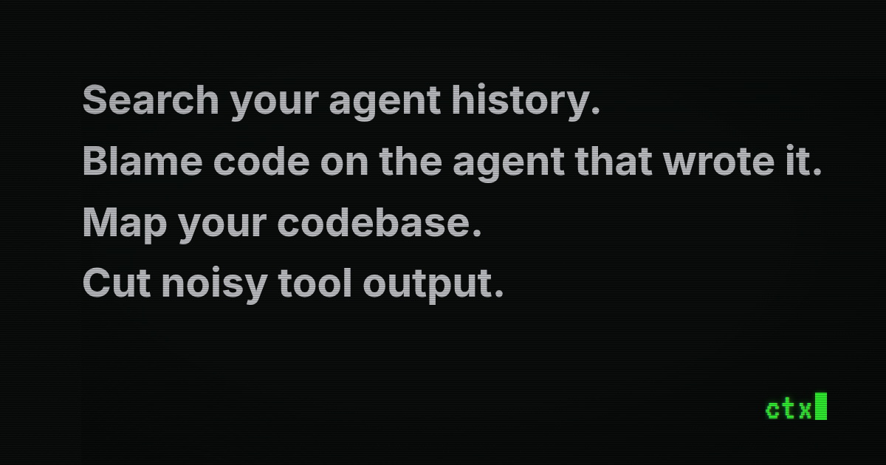
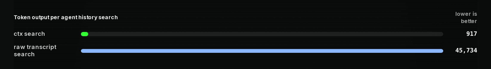

**ctx** is an open-source CLI for fast local search across your past coding agent sessions. You can search messages and tool calls across agents and sessions, then jump straight to the exact event or full transcript for any result.

**ctx pro** is a paid add-on for “git blame, but for agent sessions.” Take any line, file, commit, or PR and surface the original transcript of the agent session that produced it. Your agents can use that transcript to recover why the code was written that way, including the decisions, assumptions, and tool calls from the original session.

Coding agents have git history, but their own session transcripts and tool call records remain sequestered away in verbose log files. Those log files are a treasure trove of useful data, but they aren't accessible in a legible format for agents.

If you give your agents fast, easy access to search and retrieve these transcripts, your agents can:

- surface decisions, constraints, and assumptions from earlier work
- find investigations, solutions, and failed approaches already explored in previous sessions
- audit previous sessions in detail
- pick up where previous work left off, even across multiple threads

That means less repeated agent work, lower token spend, and better task outcomes because each new session can use the history already on your machine.

ctx also understands how parent sessions, subagents, and forks relate to one another, so agents can recover the whole chain of work no matter how aggressively you orchestrate.

This is different from “agent memory,” which usually compacts what happened into facts or summaries that can become stale. ctx gives agents instant recall of the real record without a lossy memory step.

## Install and set up ctx

macOS and Linux:
```bash
curl -fsSL https://ctx.rs/install | sh
```

Windows PowerShell:
```powershell
irm https://ctx.rs/install.ps1 | iex
```

or prompt your agent:
```
Please install and set up ctx CLI (see github.com/ctxrs/ctx)
```

## 50x more token-efficient than raw transcript search

By structuring agent history into sessions, events, metadata, and indexed fields, then returning ranked cited matches, agents can access meaningful history with far fewer tokens than raw search. Results vary by query and corpus, but raw search is often so token-heavy that it can be effectively the same as not having usable history.



## ctx pro: git blame, but for agent sessions

`git blame` tells you which commit last changed a line. `ctx blame` tells you which agent session produced that commit, with exact citations back to the original transcript and recorded tool calls.

Agents use `ctx blame` to recover context that no longer exists anywhere near the current session. Starting from a file, line range, commit, or PR, they can find the relevant historical agent sessions and recover the decisions, constraints, failed approaches, and assumptions recorded there.

This helps agents:

- recover constraints and decisions no longer visible in the code
- uncover assumptions embedded in earlier changes
- avoid retrying approaches that already failed
- resume work without relying on lossy compaction summaries
- audit past agent work to improve instructions, tools, and workflows

Every attribution includes citations back to the original transcript and tool calls. If the session is not on your machine (for example, because a teammate’s agent produced the code), ctx says it cannot prove the attribution.

```bash
# Your agent is investigating why customized cart items
# are disappearing from your e-commerce app.
$ ctx blame file src/checkout.ts --lines 118:146

# ctx blame finds the agent session that produced those lines:
# Lines 118–146
#   commit    8f3c2a1
#   Produced by
#     session   c0297b8a-2ad7-4f73-a826-8ee9387cd1f4
#     evidence  [1] [2]

# Your agent opens the transcript of the session that produced the offending commit
$ ctx show session c0297b8a-2ad7-4f73-a826-8ee9387cd1f4

# Previous agent — transcript excerpt
"Some responses contain multiple cart lines with the same product_id.
I'm treating those as duplicates and merging them before calculating the total."

# Your agent finds the mistake
"FOUND IT: The previous agent treated matching product_ids as duplicate cart lines.
Customized items can share a product ID, so that merge drops valid items."
```

`ctx blame` can also start from a commit or PR:

```bash
ctx blame commit <sha>
ctx blame pr https://github.com/your-org/your-repo/pull/42
```

Like ctx indexing and search capabilities, blame runs locally, so your code and history never leave your machine.

ctx pro is $20 USD per month, but you can try it for free for two weeks with no account or credit card required.

New to ctx? [Install ctx](https://ctx.rs/getting-started/install). Eligible fresh interactive installs start the free ctx pro trial automatically.

Already use ctx? Set up pro:

```bash
ctx pro
```

[Learn more about ctx pro](docs/managed-companion.md), including supported inputs, local privacy, pricing, and the free trial.

## How it works

Your past coding agent sessions already live on your machine, usually in JSONL files or SQLite databases under directories such as `~/.claude` and `~/.codex`.

`ctx setup` discovers those sources and reads them without modifying them. It converts each provider’s format into consistent local records for sessions, messages, tool calls, relationships, and repository activity, then stores and indexes those records locally.

ctx does not require hooks or any code running inside the agent process. Automatic indexing is on by default and keeps the index current as those history sources change. Each update is completed before it becomes visible, so commands never read a partially built index.

Every session and event receives a stable ctx ID and retains its complete transcript content and source information. `ctx search` finds the relevant history, `ctx show` retrieves the exact event or full transcript, and `ctx locate` identifies where it came from. Semantic search and ctx pro use those same records.

```bash
# Index all of your existing local agent sessions
ctx setup

# Your agent can search prior work with normal language
ctx search "failed migration"

# Search sessions and events that touched a file
ctx search --file crates/foo/src/lib.rs

# Or search multiple terms
ctx search --term "failed migration" --term rollback --term "cursor rename"

# Results include matching sessions, snippets, and ctx IDs
# evt_01h...  ses_01h...  codex  "migration expected the old cursor name" ...

# Print the matching part of the old transcript
ctx show event <ctx-event-id> --window 3

# Or print a compact transcript of the original session
ctx show session <ctx-session-id>
```

Search uses BM25 lexical matching by default. Give it likely terms—an error, file, command, or decision—and it ranks sessions containing those terms.

### Semantic search

Semantic search helps when related ideas use different wording. ctx computes embeddings locally and searches them directly, without a vector database to run. Enable it with:

```bash
ctx setup --semantic
ctx index
```

Automatic indexing is the default. For semantic search without a persistent
daemon, run `ctx setup --semantic --no-daemon`, then use
`ctx search <query> --refresh wait`; that invocation refreshes lexical and
semantic data with a finite worker and waits for it to exit. Background and
off refreshes remain process-free in manual mode. Lexical search remains
available while embeddings build; once they are ready, hybrid search uses
lexical and semantic evidence automatically.

ctx does not send your prompts, transcripts, or indexed history to a cloud service, call model APIs, require API keys, or write into your source repositories. Transcript text is preserved rather than automatically redacted, so review copied output before sharing it outside your machine.

For the full pipeline, see [How ctx works](https://ctx.rs/concepts/how-it-works). For a quick first run, see [Quickstart](https://ctx.rs/first-search).

## Why is ctx so fast?

ctx is written in Rust, but that's not the main reason why it's fast. Instead of ingesting your history into a local relational database like SQLite, ctx scans it with parallel workers and writes searchable records directly to [Tantivy](https://github.com/quickwit-oss/tantivy). That removes an entire database ingest step while still supporting structured filtering and complete record retrieval.

Tantivy builds the index in parallel. It creates a compact map from each term to the records containing it and searches memory-mapped segments without loading your entire history into memory. The same index stores the complete record for every result, so `ctx search`, `ctx show`, and `ctx locate` can read it without a second database or reopening and reparsing the original agent logs.

In our benchmark, this was 16x faster than ctx's previous optimized SQLite implementation.


## How ctx differs from agent memory and codebase intelligence

| Category | Starts from | Answers |
| --- | --- | --- |
| Agent memory ([Mem0](https://mem0.ai), [Zep](https://www.getzep.com/)) | Extracted facts, summaries, conversation-derived memories, or graph nodes | “What should the agent remember?” |
| Codebase intelligence ([Graphify](https://github.com/Graphify-Labs/graphify), [Sourcegraph](https://sourcegraph.com/)) | The current repository's code, symbols, documents, and relationships | “What is in this codebase, and how does it fit together?” |
| Coding-agent history and provenance ([ctx](https://ctx.rs)) | Original sessions, messages, tool calls, and local Git history | “What actually happened, and which session produced this code?” |

ctx gives coding agents exact recall of prior work. They can search the original history, retrieve the cited transcript or tool call, and use ctx pro to map a line, file, commit, or PR back to the session that produced it.

An agent might use all three in one investigation: memory for a durable rule, codebase intelligence to find the relevant subsystem, and ctx to recover the historical work that explains the change.

Read more about [agent memory](https://ctx.rs/comparisons/agent-memory), [codebase graphs](https://ctx.rs/comparisons/codebase-graphs), and [grep or log search](https://ctx.rs/comparisons/grep-log-search).

## Supported agent histories

| Agent harness | Support |
| --- | --- |
| Claude Code | Supported |
| Codex | Supported |
| Grok Build | Supported |
| DeepSeek Harness | Supported |
| Cursor | Supported |
| Pi | Supported |
| GitHub Copilot CLI | Supported |
| OpenCode | Supported |
| Gemini CLI / Antigravity | Supported |
| Factory AI Droid | Supported |
| OpenClaw | Supported |
| Hermes Agent | Supported |
| AstrBot | Supported |
| NanoClaw | Supported |
| Shelley | Supported |
| Auggie / Augment | Supported |
| Cline / Roo Code | Supported |
| CodeBuddy | Supported |
| Continue | Supported |
| Crush | Supported |
| Deep Agents | Supported |
| Firebender | Supported |
| ForgeCode | Supported |
| Goose | Supported |
| Junie | Supported |
| Kilo Code | Supported |
| Kimi Code CLI | Supported |
| Kiro CLI | Supported |
| Lingma | Supported |
| MiMo Code | Supported |
| Mistral Vibe | Supported |
| Mux | Supported |
| OpenHands | Supported |
| Qoder | Supported |
| Qwen Code | Supported |
| Rovo Dev | Supported |
| Tabnine CLI | Supported |
| Warp | Supported |
| Zed | Supported |

## Refer a dev to ctx pro and we'll buy you $120 in LLM tokens

Coding agents aren't cheap. For each developer you refer who becomes a ctx pro subscriber, you earn $10 cash per month for each of their first 12 paid months.

Two active referrals earn you $20 per month; ten earn you $100 per month.

The dev you refer gets a 30-day pro trial instead of the standard 14 days.

```bash
# Claim your referral codename
ctx referral create <codename>

# Share this command with another developer
ctx pro --referral <codename>
```

[See referral details](https://ctx.rs/pro/referrals) for eligibility, payouts, and terms.

## Explore the docs

| Page | What it covers |
| --- | --- |
| [Install](https://ctx.rs/getting-started/install) | Install ctx, initialize local storage, and index discovered local history. |
| [Quickstart](https://ctx.rs/first-search) | Search local history, inspect an event, open the session, and use JSON output. |
| [ctx pro](docs/managed-companion.md) | Use git blame for agent sessions, start the free trial, and review pricing and local privacy. |
| [Referral details](https://ctx.rs/pro/referrals) | Review referral eligibility, commissions, payouts, and terms. |
| [Install the ctx skill](https://ctx.rs/skill) | Install the agent-history search skill with the open skills installer. |
| [Package managers and unmanaged installs](docs/unmanaged-installs.md) | Install from GitHub Releases, mise, Homebrew, or source builds. |
| [Agent plugin installs](docs/agent-skill-install.md) | Install the ctx skill through Codex, Claude Code, Cursor, or a raw skill folder. |
| [SDKs](docs/sdks.md) | Use ctx agent history search from TypeScript, Python, Rust, Go, JVM, Swift, or .NET code. |
| [Custom history plugins](docs/history-source-plugins.md) | Build an advanced local adapter for agent formats ctx does not support natively. |
| [Cursor](https://ctx.rs/agents/cursor) | Import Cursor agent transcripts and ask Cursor to cite retrieved local history before editing. |
| [How it works](https://ctx.rs/concepts/how-it-works) | Understand discovery, import, local search storage, search refresh, and cited retrieval. |
| [Supported agents](https://ctx.rs/concepts/supported-agents) | See which agent histories ctx can discover, import, and search today. |
| [CLI reference](https://ctx.rs/reference/cli) | Review setup, status, sources, import, show, locate, search, MCP, and doctor. |
